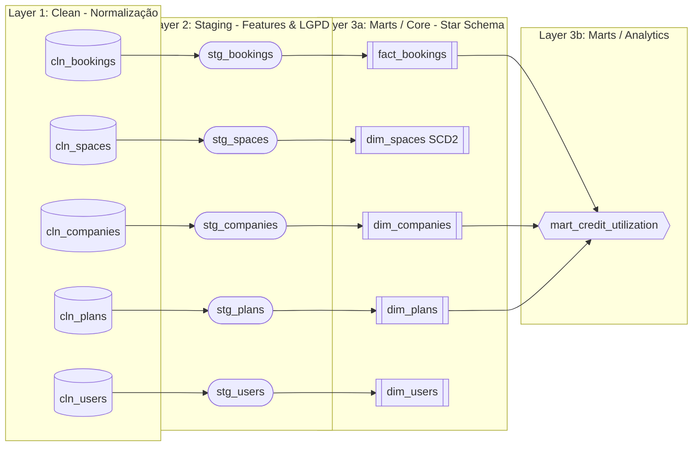
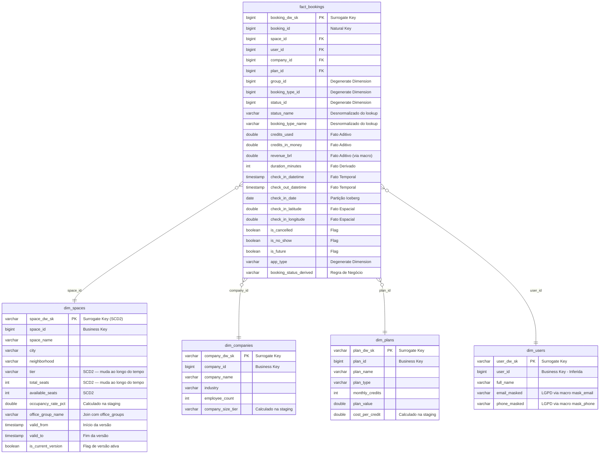

# Woba — Desafio Técnico de Analytics Engineer


Repositório com a proposta de reestruturação da plataforma analítica da Woba, migrando para uma arquitetura moderna com **dbt + Apache Iceberg + AWS Athena + Airflow (Astronomer Cosmos)**.

---

## Estrutura do Repositório

```
dags/
├── woba_cosmos_dag.py                       # DAG Airflow via Astronomer Cosmos
└── dbt/woba_bookings_dbt/
    ├── dbt_project.yml
    ├── models/
    │   ├── clean/                           # Camada 1: normalização 1:1, tipagem, surrogate keys
    │   │   ├── src_woba.yml                 # Sources (9 tabelas: 4 fornecidas + 5 inferidas)
    │   │   ├── clean_bookings.sql
    │   │   ├── clean_spaces.sql
    │   │   ├── clean_companies.sql
    │   │   ├── clean_plans.sql
    │   │   ├── clean_users.sql              # Inferida
    │   │   ├── clean_status.sql             # Inferida
    │   │   ├── clean_booking_types.sql      # Inferida
    │   │   ├── clean_office_groups.sql      # Inferida
    │   │   └── clean_reasons.sql            # Inferida
    │   ├── staging/                         # Camada 2: regras de negócio, joins, enriquecimento
    │   │   ├── stg_bookings.sql             # Status derivado, duração, desnormalização de lookups
    │   │   ├── stg_spaces.sql               # Taxa de ocupação, join com office_groups
    │   │   ├── stg_companies.sql            # Classificação de porte (Small/Medium/Large/Enterprise)
    │   │   ├── stg_plans.sql                # Custo por crédito
    │   │   ├── stg_users.sql                # Mascaramento LGPD (e-mail e telefone via macros)
    │   │   ├── stg_status.sql
    │   │   ├── stg_booking_types.sql
    │   │   ├── stg_office_groups.sql
    │   │   └── stg_reasons.sql
    │   └── marts/                           # Camada 3: DW — fatos e dimensões
    │       ├── core/
    │       │   ├── fact_bookings.sql         # Fato principal (grain: booking_id)
    │       │   ├── dim_spaces.sql            # SCD Type 2
    │       │   ├── dim_companies.sql         # SCD Type 1
    │       │   ├── dim_plans.sql             # SCD Type 1
    │       │   ├── dim_users.sql             # SCD Type 1 (dados mascarados)
    │       │   └── schema.yml               # Testes de qualidade
    │       └── analytics/
    │           └── mart_credit_utilization_l3m.sql
    ├── macros/
    │   ├── incremental_filter.sql           # Filtro incremental padronizado
    │   ├── revenue_to_reais.sql             # Conversão centavos → BRL
    │   ├── mask_email.sql                   # Mascaramento LGPD de e-mail
    │   └── mask_phone.sql                   # Mascaramento LGPD de telefone
    └── tests/
        └── assert_no_checkin_on_cancelled_booking.sql
src/
└── churn_analysis.py                        # Pipeline Python de risco de churn
.github/workflows/
└── dbt_ci_cd.yml                            # CI/CD via GitHub Actions
```

---

## Parte 1 — Modelagem Dimensional

### 1.1 Lineage e Estrutura de Camadas (DAG)

Decidi usar uma estrutura robusta de três macro-camadas (`Clean` → `Staging` → `Marts`), com a camada final dividida em `core` (Foundation / Star Schema) e `analytics` (Produtos de Dados e Modelos OBT).



### 1.2 Diagrama do Modelo Dimensional (Marts / Core)

Foco estratégico do Star Schema alimentado pela esteira apresentada acima para provisionar BI e Ad-Hocs:



### 1.2 Granularidade (Grain)

| Tabela | Grain | Justificativa |
|---|---|---|
| `fact_bookings` | **Uma linha por `booking_id`** | É o nível atômico do ato de reserva. Permite agregar por dia, empresa, plano, espaço ou grupo sem perda de informação. |

### 1.3 Tipo de SCD por Dimensão

| Dimensão | SCD | Estratégia dbt | Justificativa |
|---|---|---|---|
| `dim_spaces` | **Type 2** | `incremental` + `append` | Espaços mudam de `tier`, `total_seats` e `category` ao longo do tempo. Sem versionamento, reservas passadas seriam retroativamente recalculadas com atributos errados (ex: um Coworking Tier 1 que virou Tier 3 inflacionaria métricas históricas). A surrogate key `space_dw_sk` é composta por `(space_id, source_updated_at)`, com janelas `valid_from` / `valid_to` via `LEAD()`. |
| `dim_companies` | **Type 1** | `incremental` + `merge` | Mudanças em nome ou porte da empresa não exigem versionamento histórico para BI. A versão corrente é suficiente. |
| `dim_plans` | **Type 1** | `incremental` + `merge` | Planos raramente mudam e quando mudam aplicam-se prospectivamente. |
| `dim_users` | **Type 1** | `incremental` + `merge` | Dados de identidade com mascaramento LGPD. Não há necessidade de versionar. |

### 1.4 Justificativa da Arquitetura de Camadas (Clean → Staging → DW)

Optamos por **3 camadas** em vez de 2 (staging → DW) por separação clara de responsabilidades:

| Camada | Responsabilidade | Materialização | Exemplo |
|---|---|---|---|
| **Clean** | Normalização 1:1 com o raw. Cast de tipos, padronização de nomes, surrogate keys. **Nenhuma regra de negócio.** | `incremental` (merge) | `cast(credits as double)` |
| **Staging** | Regras de negócio, cruzamentos entre entidades, campos derivados, mascaramento LGPD. | `incremental` (merge) | `company_size_tier`, `duration_minutes`, `mask_email()` |
| **Marts/DW** | Fatos e dimensões prontos para consumo por BI, ad-hoc e IA. Tratamento de SCDs. | `incremental` (merge/append) | `fact_bookings`, `dim_spaces` (SCD2) |

**Por que não materializar a clean como `view`?** Considerando que os dados raw já chegam incrementais via Airbyte, a camada clean com materialização incremental e `merge` atua como um buffer de normalização tipada. Isso evita que a staging precise lidar com tipos inconsistentes ou mudanças de schema do conector, isolando o impacto de breaking changes do Airbyte.

### 1.5 Macros Reutilizáveis

Toda lógica repetitiva foi encapsulada em macros para garantir DRY e governança:

| Macro | Arquivo | Propósito |
|---|---|---|
| `incremental_filter` | `macros/incremental_filter.sql` | Encapsula `is_incremental()` + filtro temporal. Usado em todas as camadas. |
| `revenue_to_reais` | `macros/revenue_to_reais.sql` | Converte centavos (int) para reais (double). |
| `mask_email` | `macros/mask_email.sql` | Mascaramento LGPD: `"eduardo@woba.com"` → `"edu***@woba.com"` |
| `mask_phone` | `macros/mask_phone.sql` | Mascaramento LGPD: `"+5511998765432"` → `"***5432"` |

### 1.6 Quais tabelas ou informações precisaria solicitar ao time para completar o modelo?

Durante a construção do modelo, a tabela `raw_bookings.bookings` referencia diversas FKs (`user_id`, `status_id`, `booking_type_id`, `group_id`) cujas tabelas-mãe não foram fornecidas no escopo. Além disso, o contexto de negócio sugere a existência de entidades adicionais. Abaixo, detalho cada lacuna e por que ela importa:

#### Tabelas inferidas como necessárias

| Tabela | FK na bookings | Por que é crítica para o modelo | Impacto se ausente |
|---|---|---|---|
| `users` | `user_id` | Sem dados do colaborador (nome, e-mail, cargo), não é possível construir `dim_users` nem segmentar reservas por perfil do usuário. | Dashboards não teriam filtro por colaborador; recomendador de IA seria inviável. |
| `status` | `status_id` | Os valores de `status_id` são inteiros opacos. Sem a tabela de lookup, não sabemos se `status_id = 3` é "Confirmed" ou "Cancelled". | Toda análise de funnel (reserva → check-in → no-show) ficaria impossível. |
| `booking_types` | `booking_type_id` | Saber se uma reserva é "Individual", "Meeting Room" ou "Sala Privativa" muda completamente a análise de ocupação. | Métricas de capacidade seriam imprecisas — estações e salas de reunião têm dinâmicas distintas. |
| `office_groups` | `group_id` | Escritórios parceiros podem estar agrupados em redes ou bandeiras. Sem essa tabela, o `group_id` é um número sem significado. | Impossível analisar performance por rede de parceiros ou comparar grupos. |
| `reasons` | *(contexto)* | Motivos de cancelamento são essenciais para o time de Customer Success e para modelos preditivos de churn. | O pipeline `churn_analysis.py` não conseguiria distinguir cancelamentos por insatisfação vs. mudança de agenda. |

#### Informações adicionais que solicitaria

Além das tabelas, faria as seguintes perguntas ao time de backend:

- **`date_id` aponta para uma dim_date ou é um inteiro derivado?** Se for `YYYYMMDD` como inteiro, posso gerar a dimensão de data no próprio dbt via `dbt_date`. Se for FK para uma tabela real, preciso que ela entre no Airbyte.
- **Os campos `is_cancelled` e `is_no_show` são mutuamente exclusivos?** Se não forem, preciso tratar a prioridade no `booking_status_derived`.
- **`credits_in_money` está em centavos ou em reais?** Impacta diretamente a macro `revenue_to_reais`. No código atual, assumi centavos (padrão de gateways como Stripe/Adyen).
- **Existe soft-delete nas tabelas?** Se registros são excluídos logicamente (`deleted_at`), preciso filtrar na camada clean para não carregar dados fantasmas.

#### Como conduziria essa conversa

Não enviaria um e-mail genérico pedindo "todas as tabelas". Em vez disso, organizaria o processo em 3 passos:

**Passo 1 — Data Discovery Session (30min)**

Reunião objetiva com o Tech Lead de Bookings e o PM da squad. Levaria o diagrama ER (seção 1.1) e faria perguntas do tipo:

> *"Temos 4 FKs na tabela de bookings que apontam para tabelas que não estão no data lake: `user_id`, `status_id`, `booking_type_id` e `group_id`. Essas tabelas existem no MySQL da aplicação? Podemos adicioná-las ao conector Airbyte com schema acordado?"*

O objetivo não é pedir dados — é **mapear o que existe**, entender se são enums em código (hardcoded) ou tabelas reais no banco, e alinhar prioridade.

**Passo 2 — Formalização do Data Contract**

Após a discovery, documentaria um contrato de dados para cada tabela, definindo:

- **Schema esperado**: tipos, colunas obrigatórias, valores aceitos
- **SLA de ingestão**: frequência (ex: a cada 6h) e freshness máxima tolerada (24h)
- **Ownership**: quem é responsável por manter a tabela no MySQL e quem monitora no data lake
- **Breaking change policy**: qualquer alteração de schema precisa de PR revisado pela equipe de dados antes de ser aplicada

Esse contrato seria versionado no próprio repositório (ex: `contracts/raw_bookings.yml`) e validado automaticamente via `dbt source freshness` + tests.

**Passo 3 — Iteração pragmática (sem bloquear)**

É importante destacar: os modelos das 5 tabelas inferidas (`users`, `status`, `booking_types`, `office_groups`, `reasons`) foram construídos com **schemas hipotéticos** baseados em convenções de nomenclatura de FK e conhecimento de domínio — não no schema real do MySQL da Woba. Os nomes de colunas, tipos e até a existência de certas tabelas são propostas que precisam de validação.

O valor dessa abordagem não é "acertar o schema de primeira", e sim demonstrar que:

- A **arquitetura de 3 camadas está pronta**: clean → staging → DW, com macros, surrogate keys e incrementalidade. Isso não muda independentemente do schema real.
- O **ponto de ajuste é isolado**: quando o time confirmar o schema real, as alterações ficam restritas à camada **clean** (cast de tipos e rename de colunas). A staging e o DW continuam intactos porque consomem os nomes padronizados que nós definimos.
- Entregamos **valor parcial imediato**: mesmo sem as tabelas inferidas, a `fact_bookings` já funciona com as 4 tabelas fornecidas (`bookings`, `spaces`, `companies`, `plans`), e derivamos `booking_status_derived` a partir das flags `is_cancelled`, `is_no_show` e `is_future`, cobrindo a maior parte das análises operacionais.

### 1.7 Como um Agente de IA de Recomendação impactaria as decisões de modelagem?

Se a Woba quisesse criar um agente que recomenda espaços para colaboradores com base no histórico de reservas, o impacto na modelagem seria significativo em 4 frentes:

#### 1. O Star Schema não é consumido diretamente por ML

Modelos de Machine Learning não fazem `JOIN` — eles precisam de **tabelas planificadas** (One Big Table / Feature Store) onde cada linha é um vetor de features pronto para treinamento. O Star Schema que construído é a **fundação confiável** sobre a qual essa feature store seria montada, mas não seria o ponto de consumo direto.

**Impacto na arquitetura dbt:** criaria um novo path `marts/machine_learning/` com modelos OBT:

```
models/marts/
├── core/           ← BI e ad-hoc (já existe)
├── analytics/      ← Relatórios gerenciais (já existe)
└── machine_learning/
    └── wide_booking_features.sql   ← Feature Store para o recomendador
```

O modelo `wide_booking_features.sql` combinaria numa única tabela:

- Perfil do usuário (frequência de reservas, horário preferido, app que usa)
- Atributos do espaço **na época da reserva** (tier, capacidade, cidade)
- Métricas comportamentais (taxa de no-show do usuário, duração média)
- Variáveis geográficas (distância entre localização do check-in e endereço do espaço)

#### 2. O SCD Type 2 em `dim_spaces` previne Data Leakage

Este é o ponto mais crítico. Sem versionamento temporal dos espaços, o recomendador sofreria **Data Leakage**: aprenderia que o usuário "prefere" um espaço com 200 assentos e Tier Premium, quando na verdade na época da reserva esse espaço tinha 50 assentos e era Tier Básico.

Com o SCD2 implementado, o join para a feature store usa **point-in-time** correto:

```sql
-- Feature store com join temporal correto (evita data leakage)
select
    b.user_id,
    b.booking_id,
    b.check_in_date,
    b.duration_minutes,
    b.credits_used,
    s.tier           as tier_na_epoca,       -- Tier que o espaço tinha quando a reserva foi feita
    s.total_seats    as seats_na_epoca,       -- Capacidade na época
    s.city,
    s.occupancy_rate_pct
from fact_bookings b
inner join dim_spaces s
  on b.space_id = s.space_id
 and b.check_in_datetime >= s.valid_from
 and b.check_in_datetime < s.valid_to
where b.is_cancelled = false
  and b.is_no_show = false
```

Se tivéssemos optado por SCD Type 1 nos espaços, esse join não seria possível e o modelo de IA produziria recomendações enviesadas.

#### 3. Novas dimensões e features seriam necessárias

Para um recomendador eficaz, o modelo dimensional atual precisaria de extensões:

| Feature necessária | Fonte | Ação |
|---|---|---|
| Preferência de horário do usuário | Agregação sobre `check_in_datetime` | Calcular na feature store |
| Distância casa→espaço | `check_in_latitude/longitude` vs endereço do usuário | Solicitar endereço ao time de backend |
| Score de satisfação (NPS) | Hubspot ou pesquisa pós-reserva | Nova source no Airbyte |
| Amenities do espaço (wifi, café, sala de call) | Não existe — solicitar ao time de produto | Nova tabela `raw_bookings.space_amenities` |
| Histórico de preços do plano | Não capturado com SCD1 | Avaliar migrar `dim_plans` para SCD2 |

#### 4. Trade-off de atualização: Batch é suficiente

Para um recomendador baseado em histórico comportamental, **batch diário (ou a cada 2-4h)** tende a ser suficiente. O raciocínio parte da natureza do negócio, não de dados que temos em mãos:

- Reservas de espaço de coworking são, por natureza, eventos de baixa frequência se comparados a cliques ou transações de e-commerce — o que reduz a necessidade de atualização em tempo real
- Features comportamentais (preferência de localização, horário habitual, taxa de no-show) são derivadas de agregações históricas que mudam lentamente
- O custo de uma infraestrutura de Streaming (Kafka/Kinesis + processamento em tempo real) seria difícil de justificar sem antes validar com dados reais se a latência batch impacta a qualidade da recomendação
- A recomendação pode ser **pré-calculada em batch** e servida instantaneamente via API quando o usuário abrir o app — a percepção de "tempo real" para o usuário final não exige ingestão em tempo real

Dito isso, essa é uma hipótese que precisaria ser validada com o time de produto. Se os dados mostrarem que a frequência de reservas é alta o suficiente para que recomendações desatualizadas gerem perda de conversão, o batch precisaria ser mais agressivo (a cada hora) ou, no limite, pontual via CDC.

A exceção clara seria se a Woba lançasse um produto de **"reserva instantânea baseada em disponibilidade real"** — nesse caso, apenas os dados de `available_seats` precisariam ser near real-time, e poderíamos resolver com um CDC (Change Data Capture) pontual apenas para essa coluna, sem migrar todo o pipeline para streaming.

---

## Parte 2 — dbt na Prática

### 2.1 Estrutura do Projeto dbt

```text
dags/dbt/woba_bookings_dbt/
├── dbt_project.yml              # Materialização por camada (clean/staging: incremental, marts: definido por modelo)
├── models/
│   ├── clean/                   # 9 modelos + src_woba.yml
│   ├── staging/                 # 9 modelos
│   └── marts/
│       ├── core/                # 5 modelos (fact + dims) + schema.yml
│       └── analytics/           # 1 mart analítico
├── macros/                      # 4 macros customizadas
│   ├── incremental_filter.sql   # Filtro is_incremental() padronizado
│   ├── revenue_to_reais.sql     # Conversão centavos → BRL
│   ├── mask_email.sql           # Mascaramento LGPD de e-mail
│   └── mask_phone.sql           # Mascaramento LGPD de telefone
└── tests/
    └── assert_no_checkin_on_cancelled_booking.sql
```

**Materialização e estratégia incremental:**

Todas as camadas utilizam `incremental` com estratégia `merge`, justificado pelo uso de **AWS Athena + Apache Iceberg**:

- O Iceberg suporta merge nativo (MERGE INTO), permitindo upserts eficientes sem reprocessar o data lake inteiro
- Cada modelo define um `unique_key` via `surrogate_key` (ex: `booking_dw_sk`), garantindo idempotência
- `on_schema_change='sync_all_columns'` permite que novas colunas adicionadas pelo Airbyte sejam propagadas automaticamente
- A exceção é `dim_spaces` (SCD2), que usa `append` — cada versão do espaço é uma nova linha, não um update

### 2.2 Schema.yml — Documentação e Testes

O `schema.yml` da camada marts documenta **todos os modelos e colunas principais** com:

- `description` em cada modelo e coluna relevante
- Surrogate keys (`_dw_sk`) documentadas com tipo de geração
- Informação de materialização e estratégia incremental no header de cada modelo

### 2.3 Macros Customizadas

| Macro | Contexto de uso | Por que é útil |
|---|---|---|
| `incremental_filter(source_col, target_col)` | Todas as camadas | Elimina duplicação do bloco `` em 23 modelos |
| `revenue_to_reais(column)` | `stg_bookings` | Regra financeira centralizada — se o formato mudar (ex: centavos → reais), altera-se em 1 lugar |
| `mask_email(column)` | `stg_users` | Compliance LGPD Art. 6º, III — mascaramento aplicado na staging, protegendo todo downstream |
| `mask_phone(column)` | `stg_users` | Mesmo princípio de minimização da LGPD |

### 2.4 Testes de Qualidade

#### Testes genéricos (schema.yml)

| Tipo | Aplicado em | O que valida |
|---|---|---|
| `unique` | `booking_dw_sk`, `booking_id`, `space_dw_sk`, `company_id`, `plan_id`, `user_id` | Unicidade das PKs e SKs |
| `not_null` | Todas as PKs, SKs e FKs | Integridade referencial — nenhuma FK pode ser nula |
| `relationships` | `fact_bookings.company_id` → `dim_companies`, `fact_bookings.plan_id` → `dim_plans` | Referências válidas entre fato e dimensões |
| `accepted_values` | `booking_status_derived`, `is_cancelled`, `is_no_show`, `company_size_tier`, `is_current_version` | Domínio controlado de valores |

#### Teste singular (custom)

Arquivo: `tests/assert_no_checkin_on_cancelled_booking.sql`

```sql
-- Nenhuma reserva cancelada pode ter check-in registrado.
-- Se retornar linhas, indica bug no microsserviço de Bookings.
select
    booking_id,
    check_in_datetime,
    is_cancelled
from {{ ref('fact_bookings') }}
where is_cancelled = true
  and check_in_datetime is not null
```

Esse teste valida uma **regra de negócio estrutural**: se uma reserva foi cancelada, fisicamente o colaborador não deveria ter feito check-in. Se o teste falhar, indica uma inconsistência na aplicação de origem que precisa ser investigada com o time de backend.

### 2.5 Monitoramento dos Testes em Produção

A execução dos testes em produção é garantida em **duas camadas complementares**:

**Camada 1 — Astronomer Cosmos (Airflow):**
O Cosmos traduz cada `dbt test` em uma task do Airflow. Se qualquer teste falhar, a task fica vermelha e bloqueia as tasks downstream (ex: refresh do Power BI). Isso impede que dados inconsistentes cheguem ao dashboard.

**Camada 2 — Elementary (dbt package):**
Para monitoramento proativo, adicionaríamos o [Elementary](https://docs.elementary-data.com/) que oferece:

- **Dashboard de observabilidade** com histórico de execuções, taxa de falha por teste e tendências
- **Alertas automáticos** via webhook para Slack/Teams quando um teste específico falhar (ex: `assert_no_checkin_on_cancelled_booking`)
- **Anomaly detection** sobre métricas de volume (ex: `fact_bookings` recebeu 0 linhas hoje — potencial problema de ingestão)

A combinação das duas camadas cobre tanto o cenário reativo (Cosmos bloqueia o pipeline) quanto o proativo (Elementary alerta o time antes que o stakeholder perceba).

### 2.6 Query Analítica — Taxa de Utilização de Créditos

Arquivo: `models/marts/analytics/mart_credit_utilization_l3m.sql`

Responde: *"Qual a taxa de utilização de créditos por empresa nos últimos 3 meses, segmentada por tipo de plano, e como ela se compara com a média geral?"*

**Decisões de performance para Athena/Iceberg:**

- Filtro `check_in_date >= date_add('month', -3, current_date)` para **partition pruning** no Iceberg
- `NULLIF` para evitar divisão por zero sem try/catch
- `CROSS JOIN` com CTE escalar (1 linha `media_geral`) para evitar subquery correlacionada
- Colunas explícitas em todas as CTEs (sem `select *`)

**Output do modelo:**

| Coluna | Tipo | Descrição |
|---|---|---|
| `taxa_utilizacao_perc` | double | % de créditos usados vs. disponíveis no trimestre |
| `media_geral_rede_perc` | double | Média de utilização de toda a rede |
| `delta_vs_media` | double | Diferença em pontos percentuais vs. média |
| `status_de_engajamento` | varchar | Classificação: 'Crítico (Risco Churn)', 'Abaixo da Média', 'Acima da Média' |

### 2.7 Pipeline Python — Análise de Churn

Arquivo: `src/churn_analysis.py`

Script que consome o output do mart analítico, identifica empresas com utilização abaixo de 30% e exporta para JSON ou CSV.

**Boas práticas aplicadas:**

- Type hints em todas as funções
- Docstrings descritivas com Args/Returns
- `argparse` para parametrização via CLI (`--threshold`, `--output`)
- Classificação em dois níveis de risco: `CRITICAL` (< 15%) e `HIGH` (< 30%)
- Suporte a exportação JSON e CSV
- Comentário indicando como seria a leitura em produção (awswrangler)

**Execução:**

```bash
# Default: threshold 30%, output JSON
python src/churn_analysis.py

# Customizado: threshold 25%, output CSV
python src/churn_analysis.py --threshold 25 --output csv
```

**Output de exemplo:**

```text
============================================================
Pipeline de Churn — Threshold: 30.0%
============================================================
[LOAD] 5 empresas carregadas do mart
[FILTER] 3 empresas abaixo de 30.0% de utilização
[JSON] Exportados 3 empresas → src/data/churn_candidates.json

Resumo das empresas em risco:
  • Tech Inactive Inc (Medium) — 16.6% utilização — Risco: HIGH
  • Startup Lenta (Small) — 25.0% utilização — Risco: HIGH
  • Low Engage SA (Medium) — 24.0% utilização — Risco: HIGH
```

---

## Parte 3 — Colaboração e Dados como Produto

### Cenário A — Demanda Ambígua de Negócio

> *"Preciso de um dashboard para acompanhar a performance dos espaços parceiros. Consegue montar até semana que vem?"* — Head de Operações

#### 1. Abordagem: Como estruturar e riscos

Aceitar essa demanda passivamente tem um risco alto de gerar "débito de adoção" (dashboard construído, mas não consumido) e retrabalho, pois "performance" é um termo altamente subjetivo.

Minha primeira ação seria **não prometer o dashboard para a próxima semana**. Em vez disso, bloquearia 45 minutos na agenda do Head para uma sessão de *Discovery*. **Crucial: eu não iria sozinho**. Envolveria um profissional de **Data Analytics** na reunião, pois, embora eu tenha capacidade de atuar end-to-end, quem estará na linha de frente desenhando e iterando a visualização final com a área de negócios é o Analista. Minha função ali é me aproximar de negócios para entender proativamente o escopo e garantir que a base arquitetural e a modelagem suprirão as necessidades.

**Perguntas que eu levaria:**

1. **O que é "performance" para a Woba hoje?** (Estamos medindo churn de parceiros, ocupação sobressalente, ou NPS dos usuários finais?)
2. **Qual é a decisão de negócio que esse dashboard vai destravar?** (Se o espaço estiver performando mal, nós o descredenciamos? O time de CS vai entrar em contato com ele?)
3. **Se você só pudesse ver *um* número nesse dashboard para saber como estão as coisas, qual seria?**
4. **Alinhamento de Granularidade:** "Você quer ver essa performance consolidada nacionalmente ou no detalhe do parceiro B2B?"

**Riscos que eu apontaria:**
A pressa ("até semana que vem") muitas vezes ignora limites técnicos como a ausência de dados na *Source* (ex: não temos NPS no lake ainda nesse contexto do teste) ou a falta de contratos de dados prévios. Entregar um dado não confiável na próxima semana quebra a confiança do time de Operações nos relatórios.

#### 2. Datasets Analíticos Propostos

Assumindo que a Discovery identificou três pilares de performance (Engajamento, Financeiro e Satisfação), criaríamos um novo mart analítico `mart_space_performance_monthly.sql`.

**Métricas Relevantes:**

- `taxa_ocupacao_mensal_perc`: (Total de check-ins executados) / (Assentos disponíveis x Dias úteis)
- `receita_bruta_gerada_brl`: Soma do `revenue_brl` onde o status é completed.
- `no_show_rate_perc`: Reservas que viraram "no-show" (relevante para prever lugares ociosos).
- `nps_medio` *(dependente da ingestão de uma nova tabela de avaliações)*.

**O que muda no dbt:**
Aproveitaríamos a `fact_bookings` e a `dim_spaces` que já criamos na Etapa 1. O novo modelo (`mart_space_performance_monthly`) agruparia as informações em granularidade mensal `(date_month, space_id)`.

**Garantia de Confiança (Freshness & Reliability):**

1. **Source Freshness:** Configuraríamos um SLA no `src_woba.yml` para alertar se a replicação do Airbyte atrasar mais de 4h. Isso impede o BI de consumir dado velho sem nosso conhecimento.
2. **Elementary Data Observability:** Teríamos o pacote rodando testes de anomalia de volume (`volume_anomalies`), garantindo não apenas que o schema está correto, mas que o volume diário de reservas não despencou 90% repentinamente.

---

### Cenário B — Dados para Além de BI (Motor de Recomendação)

> O time de Produto quer lançar uma recomendação de espaços via IA ou regras baseada no histórico de reservas.

#### 1. Estruturação dos Dados (Mudança de Modelagem)

Cientistas de dados e motores algorítmicos consomem dados de maneira radicalmente diferente do BI. Enquanto o BI prefere modelos altamente agregados, os modelos de Machine Learning prosperam no caos do detalhe — a granularidade fina, chamada de *One Big Table (OBT)* ou *Feature Store*.

**O que muda na modelagem:**
Como já pontuado e estruturado na **Seção 1.7** deste documento, não reaproveitamos o Star Schema do BI `(core/)` para o treinamento de IA. Utilizaríamos o repositório paralelo `marts/machine_learning/` para criar a `wide_booking_features.sql` (nossa OBT), garantindo que cada linha entregue ao motor seja um **User Profile** enriquecido.

- Colunas criadas dinamicamente: `dias_da_semana_favoritos` (ex: "Terças, Quintas"), `distancia_media_deslocamento` (cruzando o CEP do usuário com o espaço), `preferencia_bairro`, e `taxa_cancelamento_historico`.

#### 2. Contratos de Dados Analíticos (Data Contracts)

#### 2. Contratos de Dados Analíticos (Data Contracts)

Como a feature ficará visível *"customer-facing"* no App, a tolerância a falhas na infraestrutura de dados é menor do que no consumo de BI interno.

Expandindo a cultura de governança já detalhada na **Seção 1.5** (onde definimos versionamento de source via `yml`), os contratos de dados firmados especificamente com o *time de Produto/IA* enfatizariam:

- **Garantia Estrutural:** O time de Analytics Engineering promete ao time de ML que as features `user_id` e `bairro_favorito` nunca terão seu cast numérico ou em string modificado sem aviso prévio. A quebra de um contrato no Pull Request falha imediatamente a CI.
- **SLA de Desempenho e Janela Temporal:** O Pipeline Batch que constrói a *Feature Store* estará pronto e validado por testes de Data Quality impreterivelmente até as 06:00 a.m. todos os dias.
- **Circuit Breakers:** Caso a taxa de anomalias ultrapasse 5%, o Pipeline intencionalmente não sobrescreve os dados do dia anterior, salvaguardando a IA de ser treinada com lixo sintático (`Famoso: Garbage In, Garbage Out`).

#### 3. Trade-offs: Batch vs. Near Real-Time

A decisão dita a arquitetura.

- Se escolhermos **Near Real-Time** (Tempo Real):
  - **Arquitetura:** Teríamos que adotar Kafka/Kinesis (Event Streaming) e Apache Flink.
  - **Impacto:** O custo triplica, a complexidade de manutenção dispara, e a necessidade de monitoramento é 24/7.
  - **É verdadeiramente necessário?** Na dinâmica corporativa de coworkings B2B, a reserva de um espaço tende a ser um comportamento planejado (ex: encontros da squad, ida ao escritório na terça/quinta) e não um evento hiperfrequente de milissegundos. Características demográficas e preferências daquele colaborador (como proximidade e *amenities*) não mudam várias vezes durante o mesmo dia.

- **Minha abordagem sugerida (Batch primeiro):**
  - Optaria pelo processo **Batch** processado de madrugada usando nossa stack atual (dbt + Airflow).
  - Prever ou recomendar um espaço para um usuário baseia-se em seu histórico de meses passados, e isso não muda em 5 minutos.
  - O motor de Machine Learning pode calcular as recomendações "offline", escrevê-las em um banco chave-valor rápido como um *Redis* ou um *DynamoDB*.
  - Quando o usuário abrir o App/web Woba às 09:00, o Backend apenas busca do Redis instantaneamente a lista pré-pronta gerada na noite anterior. O usuário tem a percepção de ser instantâneo sem o peso financeiro e estrutural do streaming.

---

## Parte 4 — Bônus (CI/CD)

Arquivo: `.github/workflows/dbt_ci_cd.yml`

### Como garantimos que código quebrado não vai a produção?

1. **Pull Request (CI):**
   - `dbt compile` + `dbt test --select state:modified+ --defer` roda automaticamente
   - Testa apenas modelos afetados pela branch
   - PR bloqueado se qualquer teste falhar

2. **Merge na Main (CD):**
   - Aciona deploy no Astronomer (Airflow produtivo)
   - Gera `dbt docs` e publica no S3 (webhosting serverless)

---

## Nota de Transparência Institucional sobre IA

Este desafio foi desenvolvido aliando Engenharia de Analytics a ferramentas de inteligência artificial de fronteira, especificamente o modelo **Gemini 3.1 Pro e Claude Opus 4.6**.

Como a **IA auxiliou** sob meu comando (*Prompting* e revisão constante):

- Utilização do framework interno do projeto via diretório oculto `.agents/workflows/`, onde as regras de negócio e passos documentados atuaram como "memória e prompt ops" para a execução assistida.
- Automação inicial do "scaffold" do repositório (diretórios, boilerplate de YAMLs e configurações DDL).
- Formatação do markdown e geração dos gráficos via Mermaid.js junto de correção ortográfica e gramatical.

Onde o **Humano e Visão de Negócio prevaleceram**:

- Visão estratégica de tradeoffs.
- Tomada exata de decisões arquiteturais do pipeline.
- Reengenharia dimensional e design avançado dos Contratos de Dados Analíticos e CI/CD, além do framework de validaçāo proativa e governança compliance (LGPD).
